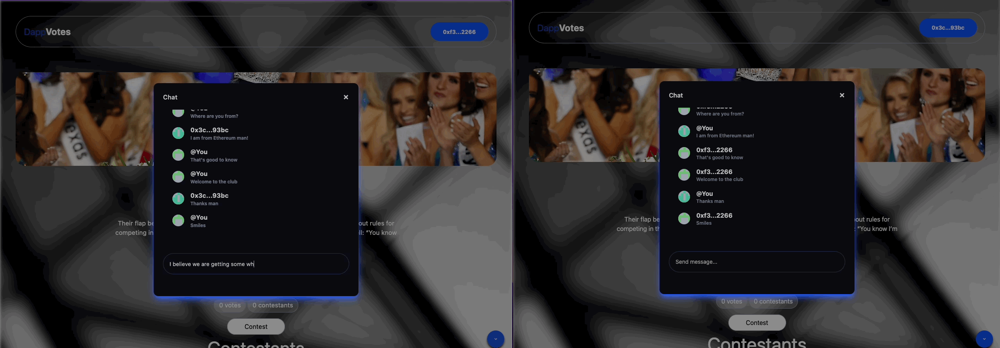

# Build a Decentralized Voting Dapp with Next.js, TypeScript, Tailwind CSS, and CometChat

Read the full tutorial here: [**>> Build a Decentralized Voting Dapp with Next.js, TypeScript, Tailwind CSS, and CometChat **](https://daltonic.github.io)

This example shows Build a Decentralized Voting Dapp with Next.js, TypeScript, Tailwind CSS, and CometChat:


<center><figcaption>Poll Listing</figcaption></center>


<center><figcaption>Poll Details with Candidates</figcaption></center>



<center><figcaption>Poll Group Chat</figcaption></center>

## Technology

This demo uses:

- Metamask
- Hardhat
- Infuria
- ReactJs
- Tailwind CSS
- Solidity
- EthersJs
- Faucet

## Running the demo

To run the demo follow these steps:

1. Clone the project with the code below.

   ```sh

   # Make sure you have the above prerequisites installed already!
   git clone https://github.com/Daltonic/dappVote PROJECT_NAME
   cd PROJECT_NAME # Navigate to the new folder.
   yarn install # Installs all the dependencies.
   ```

2. Create a CometChat project, copy and paste your key in the spaces below.
3. Update the `.env` file with the following details.
   ```sh
    NEXT_PUBLIC_COMET_CHAT_APP_ID=<CometChat_APP_ID>
    NEXT_PUBLIC_COMET_CHAT_AUTH_KEY=<Comet_Chat_AUTH_KEY>
    NEXT_PUBLIC_COMET_CHAT_REGION=<CometChat_REGION>
    NEXT_APP_RPC_URL=<http://127.0.0.1:8545>
   ```
4. Run the app using the following commands.
   ```sh
   yarn install
   yarn hardhat node
   yarn hardhat run scripts/deploy.js
   ```
5. On another terminal, run `yarn start` to launch the project on the browser.
6. Add some hardhat accounts, connect your wallet and interact with the app.
   <br/>


